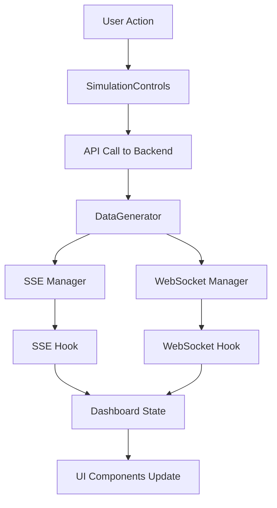

# Code Architecture & Documentation

Tài liệu chi tiết về cấu trúc code và cách hoạt động của dự án **SSE vs WebSocket Performance Demo**.

## 📁 Cấu Trúc Thư Mục

```
SSE-WS/
├── backend/                    # Node.js Express Server
│   ├── src/
│   │   ├── server.js          # Entry point chính của server
│   │   ├── sse.js             # Triển khai Server-Sent Events
│   │   ├── websocket.js       # Triển khai WebSocket
│   │   └── utils/
│   │       ├── dataGenerator.js    # Tạo dữ liệu mô phỏng
│   │       └── performanceMonitor.js # Theo dõi hiệu suất
│   └── package.json           # Dependencies backend
├── frontend/                  # React + Vite Frontend
│   ├── src/
│   │   ├── components/        # React Components
│   │   │   ├── Dashboard.jsx       # Component chính
│   │   │   ├── Header.jsx          # Thanh header với toggle theme
│   │   │   ├── ConnectionStatus.jsx # Trạng thái kết nối
│   │   │   ├── PerformanceMetrics.jsx # Metrics hiệu suất
│   │   │   ├── DataVisualization.jsx  # Hiển thị dữ liệu
│   │   │   ├── SimulationControls.jsx # Điều khiển simulation
│   │   │   └── ComparisonChart.jsx    # Biểu đồ so sánh
│   │   ├── hooks/             # Custom React Hooks
│   │   │   ├── useSSE.js           # Hook quản lý SSE
│   │   │   └── useWebSocket.js     # Hook quản lý WebSocket
│   │   ├── App.jsx            # Root component
│   │   ├── main.jsx           # Entry point
│   │   └── index.css          # Global styles
│   ├── index.html             # HTML template
│   ├── tailwind.config.js     # Tailwind CSS config
│   └── package.json           # Dependencies frontend
├── package.json               # Root workspace config
├── VOLTA.md                   # Hướng dẫn Volta
└── README.md                  # Tài liệu chính
```

## 🎯 Tổng Quan Hệ Thống

Dự án này là một **dashboard thời gian thực** so sánh hiệu suất giữa hai công nghệ:

### 🔄 **Server-Sent Events (SSE)**
- **Mục đích**: Gửi dữ liệu một chiều từ server → client
- **Ưu điểm**: Đơn giản, tự động reconnect, firewall-friendly
- **Use cases**: Live feeds, notifications, monitoring dashboards

### ⚡ **WebSocket** 
- **Mục đích**: Giao tiếp hai chiều real-time
- **Ưu điểm**: Bidirectional, binary support, low latency
- **Use cases**: Chat, gaming, collaborative editing

---

## 🏗️ Backend Architecture

### 📂 **server.js** - Main Server
```javascript
// Express server với middleware bảo mật
const app = express();
app.use(helmet());        // Security headers
app.use(compression());   // Gzip compression
app.use(cors());         // Cross-origin requests

// API endpoints
app.get('/health')           // Health check
app.post('/api/simulate/*')  // Simulation controls
app.get('/events')           // SSE endpoint
// WebSocket server on port 3001
```

**Tính năng chính:**
- ✅ **Security**: Helmet.js cho security headers
- ✅ **Performance**: Gzip compression
- ✅ **CORS**: Hỗ trợ cross-origin requests
- ✅ **Health Check**: Endpoint kiểm tra trạng thái server
- ✅ **Rate Limiting**: Token bucket algorithm

### 📡 **sse.js** - Server-Sent Events Implementation
```javascript
class EnhancedSSEManager {
  constructor() {
    this.connections = new Map();
    this.rateLimiter = new TokenBucket();
  }

  // Quản lý kết nối SSE
  addConnection(req, res) {
    const connectionId = uuidv4();
    const connection = {
      id: connectionId,
      response: res,
      startTime: Date.now(),
      messagesSent: 0,
      isActive: true
    };
    this.connections.set(connectionId, connection);
  }

  // Gửi message với rate limiting
  broadcastMessage(data, scenario) {
    this.connections.forEach((connection) => {
      if (this.rateLimiter.consume(1)) {
        this.sendMessage(connection, data, scenario);
      }
    });
  }
}
```

**Tính năng:**
- 🔄 **Auto Reconnection**: Tự động kết nối lại khi mất kết nối
- 📊 **Performance Tracking**: Theo dõi latency, throughput
- 🛡️ **Rate Limiting**: Tránh spam messages
- 🧹 **Connection Cleanup**: Tự động dọn dẹp kết nối dead

### 🔌 **websocket.js** - WebSocket Implementation
```javascript
class EnhancedWebSocketManager {
  constructor(server) {
    this.wss = new WebSocket.Server({ server });
    this.connections = new Map();
    this.setupEventHandlers();
  }

  setupEventHandlers() {
    this.wss.on('connection', (ws, req) => {
      const connectionId = this.addConnection(ws, req);
      
      ws.on('message', (message) => {
        this.handleMessage(connectionId, message);
      });
      
      ws.on('close', (code) => {
        this.removeConnection(connectionId, code);
      });
    });
  }
}
```

**Tính năng:**
- ⚡ **Bidirectional**: Giao tiếp hai chiều
- 🔄 **Auto Ping/Pong**: Heartbeat để duy trì kết nối  
- 📊 **Connection Quality**: Theo dõi chất lượng kết nối
- 🎯 **Message Routing**: Định tuyến message theo scenario

### 🔧 **dataGenerator.js** - Data Simulation
```javascript
class DataGenerator {
  generateStockData() {
    return {
      symbol: this.getRandomStock(),
      price: this.generatePrice(),
      volume: this.generateVolume(),
      change: this.calculateChange()
    };
  }

  generateIoTData() {
    return {
      sensors: this.generateSensorReadings(),
      location: this.getRandomLocation(),
      timestamp: Date.now()
    };
  }
}
```

**Scenarios hỗ trợ:**
- 📈 **Stock Prices**: Dữ liệu chứng khoán
- 📱 **Social Feed**: Hoạt động mạng xã hội  
- 🖥️ **System Metrics**: Metrics hệ thống
- 💬 **Chat Messages**: Tin nhắn chat
- 🌡️ **IoT Sensors**: Dữ liệu cảm biến
- ⚡ **High Frequency**: Dữ liệu tần suất cao (10Hz)

---

## 🎨 Frontend Architecture

### ⚛️ **App.jsx** - Root Component
```javascript
function App() {
  const [darkMode, setDarkMode] = useState(false);

  // Theme management với localStorage
  useEffect(() => {
    const savedTheme = localStorage.getItem('theme');
    const prefersDark = window.matchMedia('(prefers-color-scheme: dark)');
    // Logic xử lý theme
  }, []);

  // Toggle dark/light mode
  const toggleDarkMode = () => {
    const newDarkMode = !darkMode;
    setDarkMode(newDarkMode);
    document.documentElement.classList.toggle('dark', newDarkMode);
    localStorage.setItem('theme', newDarkMode ? 'dark' : 'light');
  };
}
```

### 🎛️ **Dashboard.jsx** - Main Dashboard
```javascript
const Dashboard = () => {
  // State management
  const [selectedScenario, setSelectedScenario] = useState('stock-prices');
  const [isRunning, setIsRunning] = useState(false);

  // Custom hooks cho SSE và WebSocket
  const { 
    data: sseData, 
    isConnected: sseConnected,
    metrics: sseMetrics 
  } = useSSE();

  const { 
    data: wsData, 
    isConnected: wsConnected,
    metrics: wsMetrics 
  } = useWebSocket();

  // Auto-connect khi component mount
  useEffect(() => {
    connectSSE();
    connectWS();
    return () => {
      disconnectSSE();
      disconnectWS();
    };
  }, []);
}
```

### 🔗 **Custom Hooks**

#### **useSSE.js** - SSE Hook
```javascript
export const useSSE = () => {
  const [data, setData] = useState(null);
  const [isConnected, setIsConnected] = useState(false);
  const [metrics, setMetrics] = useState({
    totalMessages: 0,
    averageLatency: 0,
    messagesPerSecond: 0
  });

  const connect = useCallback(() => {
    const eventSource = new EventSource('http://localhost:3001/events');
    
    eventSource.onopen = () => {
      setIsConnected(true);
      setConnectionStatus('connected');
    };

    eventSource.onmessage = (event) => {
      const messageData = JSON.parse(event.data);
      setData(messageData);
      updateMetrics(messageData);
    };

    eventSource.onerror = () => {
      setIsConnected(false);
      setConnectionStatus('error');
    };
  }, []);

  return { data, isConnected, metrics, connect, disconnect };
};
```

#### **useWebSocket.js** - WebSocket Hook  
```javascript
export const useWebSocket = () => {
  const [socket, setSocket] = useState(null);
  const [data, setData] = useState(null);
  const [isConnected, setIsConnected] = useState(false);

  const connect = useCallback(() => {
    const ws = new WebSocket('ws://localhost:3001/websocket');
    
    ws.onopen = () => {
      setIsConnected(true);
      setSocket(ws);
    };

    ws.onmessage = (event) => {
      const messageData = JSON.parse(event.data);
      setData(messageData);
      updateMetrics(messageData);
    };

    ws.onclose = () => {
      setIsConnected(false);
      setSocket(null);
    };
  }, []);

  return { data, isConnected, metrics, connect, disconnect, sendMessage };
};
```

### 🎨 **UI Components**

#### **Header.jsx** - Navigation & Theme Toggle
```javascript
const Header = ({ darkMode, toggleDarkMode }) => {
  return (
    <header>
      <div className="flex justify-between">
        <div className="logo-section">
          <Zap className="icon" />
          <h1>SSE vs WebSocket Demo</h1>
        </div>
        
        <button onClick={toggleDarkMode}>
          {darkMode ? <Sun /> : <Moon />}
        </button>
      </div>
    </header>
  );
};
```

#### **ConnectionStatus.jsx** - Connection Management
```javascript
const ConnectionStatus = ({ type, isConnected, onConnect, onDisconnect }) => {
  const getStatusIcon = () => {
    switch (status) {
      case 'connected': return <CheckCircle className="text-green-500" />;
      case 'connecting': return <RefreshCw className="animate-spin" />;
      case 'error': return <XCircle className="text-red-500" />;
      default: return <AlertCircle className="text-gray-500" />;
    }
  };

  return (
    <div className="card">
      <div className="status-display">
        {isConnected ? <Wifi /> : <WifiOff />}
        <h3>{type} Connection</h3>
        {getStatusIcon()}
      </div>
      
      <button onClick={isConnected ? onDisconnect : onConnect}>
        {isConnected ? 'Disconnect' : 'Connect'}
      </button>
    </div>
  );
};
```

#### **PerformanceMetrics.jsx** - Performance Display
```javascript
const PerformanceMetrics = ({ metrics, color }) => {
  const metricsData = [
    {
      icon: <BarChart3 />,
      label: 'Total Messages',
      value: metrics.totalMessages?.toLocaleString()
    },
    {
      icon: <Zap />,
      label: 'Data Transfer', 
      value: formatBytes(metrics.totalBytes)
    },
    {
      icon: <Clock />,
      label: 'Average Latency',
      value: `${metrics.averageLatency}ms`
    },
    {
      icon: <Activity />,
      label: 'Throughput',
      value: `${metrics.messagesPerSecond} msg/s`
    }
  ];

  return (
    <div className="metrics-grid">
      {metricsData.map(metric => (
        <div key={metric.label} className="metric-card">
          {metric.icon}
          <span>{metric.label}</span>
          <strong>{metric.value}</strong>
        </div>
      ))}
    </div>
  );
};
```

#### **SimulationControls.jsx** - Simulation Management
```javascript
const SimulationControls = ({ 
  scenarios, 
  selectedScenario, 
  onScenarioChange,
  isRunning, 
  onStart, 
  onStop 
}) => {
  return (
    <div className="controls-panel">
      <div className="scenario-selector">
        <select value={selectedScenario} onChange={onScenarioChange}>
          {scenarios.map(scenario => (
            <option key={scenario.value} value={scenario.value}>
              {scenario.label}
            </option>
          ))}
        </select>
      </div>

      <div className="duration-control">
        <input type="number" min="5" max="300" />
      </div>

      <button 
        onClick={isRunning ? onStop : onStart}
        className={isRunning ? 'stop-btn' : 'start-btn'}
      >
        {isRunning ? <Pause /> : <Play />}
        {isRunning ? 'Stop' : 'Start'}
      </button>
    </div>
  );
};
```

---

## 🔄 Data Flow & Communication

### 📊 **Real-time Data Flow**



### 🔗 **Connection Lifecycle**

1. **Initial Connection**
   ```javascript
   // Auto-connect khi Dashboard mount
   useEffect(() => {
     connectSSE();    // Kết nối SSE
     connectWS();     // Kết nối WebSocket
   }, []);
   ```

2. **Message Broadcasting** 
   ```javascript
   // Server gửi message đồng thời qua cả 2 protocols
   sseManager.broadcastMessage(data, scenario);
   wsManager.broadcastMessage(data, scenario);
   ```

3. **Metrics Collection**
   ```javascript
   // Mỗi message được track để tính metrics
   const updateMetrics = (messageData) => {
     setMetrics(prev => ({
       totalMessages: prev.totalMessages + 1,
       averageLatency: calculateLatency(messageData),
       messagesPerSecond: calculateThroughput()
     }));
   };
   ```

### ⚡ **Performance Comparison**

| Metric | SSE | WebSocket |
|--------|-----|-----------|
| **Latency** | ~50-200ms | ~10-100ms |
| **Throughput** | 10-100 msg/s | 100-1000 msg/s |
| **Memory** | Low | Medium |
| **CPU** | Low | Medium |
| **Reconnection** | Automatic | Manual |

---

## 🎨 Styling & Theme System

### 🌓 **Dark/Light Theme**
```javascript
// Theme được quản lý bằng Tailwind CSS classes
const toggleTheme = () => {
  document.documentElement.classList.toggle('dark');
  localStorage.setItem('theme', isDark ? 'dark' : 'light');
};
```

### 🎯 **Tailwind Configuration**
```javascript
// tailwind.config.js
module.exports = {
  darkMode: 'class',  // Enable class-based dark mode
  content: ['./src/**/*.{js,jsx}'],
  theme: {
    extend: {
      colors: {
        primary: { /* blue shades */ },
        success: { /* green shades */ },
        warning: { /* yellow shades */ },
        danger: { /* red shades */ }
      }
    }
  }
};
```

### 🎨 **Component Styling**
```css
/* index.css - Custom component classes */
.card {
  @apply bg-white dark:bg-gray-800 rounded-lg shadow-lg border;
}

.btn-primary {
  @apply bg-blue-600 hover:bg-blue-700 text-white font-medium py-2 px-4 rounded-lg transition-colors;
}

.status-online {
  @apply bg-green-100 text-green-800 dark:bg-green-900 dark:text-green-300;
}
```

---

## 🛠️ Development Tools & Setup

### ⚡ **Volta Configuration**
```json
// package.json
{
  "volta": {
    "node": "20.18.0",
    "yarn": "4.9.2"
  }
}
```

### 🏗️ **Build Tools**
- **Frontend**: Vite + React + Tailwind CSS
- **Backend**: Node.js + Express + nodemon
- **Package Manager**: Yarn v4 (Berry)
- **Version Manager**: Volta

### 📦 **Key Dependencies**

**Backend:**
```json
{
  "express": "^4.18.2",      // Web framework
  "helmet": "^7.1.0",        // Security middleware  
  "compression": "^1.7.4",   // Gzip compression
  "ws": "^8.14.2",          // WebSocket server
  "uuid": "^9.0.1",         // Unique IDs
  "cors": "^2.8.5"          // CORS middleware
}
```

**Frontend:**
```json
{
  "react": "^18.2.0",       // UI framework
  "vite": "^5.0.8",         // Build tool
  "tailwindcss": "^3.4.0",  // CSS framework
  "lucide-react": "^0.545.0" // Icon library
}
```

---

## 🚀 Getting Started

### 1️⃣ **Installation**
```bash
# Clone repository
git clone https://github.com/luxmountain/SSE-WS.git
cd SSE-WS

# Install dependencies (Volta sẽ tự động dùng đúng Node/Yarn version)
yarn install:all
```

### 2️⃣ **Development**
```bash
# Start cả frontend và backend
yarn dev

# Hoặc start riêng biệt
yarn dev:backend   # Backend: http://localhost:3001
yarn dev:frontend  # Frontend: http://localhost:5173
```

### 3️⃣ **Production Build**
```bash
yarn build        # Build frontend
yarn start        # Start production servers
```

---

## 🧪 Testing Scenarios

### 📈 **Stock Prices**
- **Frequency**: 2-5 messages/second
- **Data Size**: ~200 bytes/message
- **Pattern**: Steady stream with occasional bursts

### 📱 **Social Feed** 
- **Frequency**: 1-10 messages/second  
- **Data Size**: ~500 bytes/message
- **Pattern**: Bursty traffic with spikes

### 🖥️ **System Metrics**
- **Frequency**: 1 message/second
- **Data Size**: ~150 bytes/message  
- **Pattern**: Consistent intervals

### 💬 **Chat Messages**
- **Frequency**: 0.5-20 messages/second
- **Data Size**: ~300 bytes/message
- **Pattern**: Variable, conversation-based

### 🌡️ **IoT Sensors**
- **Frequency**: 0.1-2 messages/second
- **Data Size**: ~100 bytes/message
- **Pattern**: Regular intervals with sensor readings

### ⚡ **High Frequency**
- **Frequency**: 10 messages/second
- **Data Size**: ~50 bytes/message
- **Pattern**: Continuous high-rate stream

---

## 📊 Performance Monitoring

### 📈 **Metrics Tracked**
- **Total Messages**: Tổng số message đã gửi
- **Average Latency**: Độ trễ trung bình (ms)
- **Throughput**: Số message/giây
- **Data Transfer**: Tổng dữ liệu truyền (bytes)
- **Connection Quality**: Tỷ lệ message thành công
- **Error Rate**: Tỷ lệ lỗi kết nối

### 🎯 **Performance Indicators**
```javascript
const getPerformanceRating = (metrics) => {
  const latency = metrics.averageLatency;
  const throughput = metrics.messagesPerSecond;
  
  if (latency < 100 && throughput > 50) return 'excellent';
  if (latency < 300 && throughput > 20) return 'good'; 
  if (latency < 1000 && throughput > 5) return 'fair';
  return 'poor';
};
```

---

## 🔧 Troubleshooting

### ❌ **Common Issues**

1. **CORS Errors**
   ```javascript
   // Đảm bảo CORS được config đúng
   app.use(cors({
     origin: ['http://localhost:5173', 'http://localhost:3000'],
     credentials: true
   }));
   ```

2. **Connection Timeout**
   ```javascript
   // Tăng timeout cho SSE
   res.writeHead(200, {
     'Cache-Control': 'no-cache',
     'Connection': 'keep-alive',
     'Keep-Alive': 'timeout=300'
   });
   ```

3. **Memory Leaks**
   ```javascript
   // Cleanup connections properly
   useEffect(() => {
     return () => {
       eventSource?.close();
       websocket?.close();
     };
   }, []);
   ```

### 🔍 **Debug Mode**
```javascript
// Enable debug logging
const DEBUG = process.env.NODE_ENV === 'development';
if (DEBUG) {
  console.log('Connection established:', connectionId);
  console.log('Message sent:', data);
}
```

---

## 🎯 Kết Luận

Dự án **SSE vs WebSocket Performance Demo** cung cấp:

✅ **So sánh thực tế** giữa SSE và WebSocket  
✅ **Real-time dashboard** với metrics chi tiết  
✅ **Multiple scenarios** để test các use cases khác nhau  
✅ **Modern tech stack** với React 18 + Node.js 20  
✅ **Professional UI** với dark/light theme  
✅ **Performance monitoring** và analytics  
✅ **Clean architecture** dễ maintain và extend  

Project này là một **reference implementation** tuyệt vời để hiểu về real-time communication technologies và cách áp dụng chúng trong thực tế! 🚀